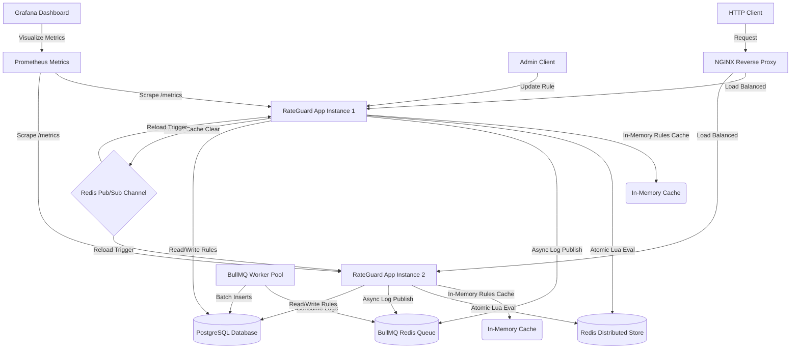
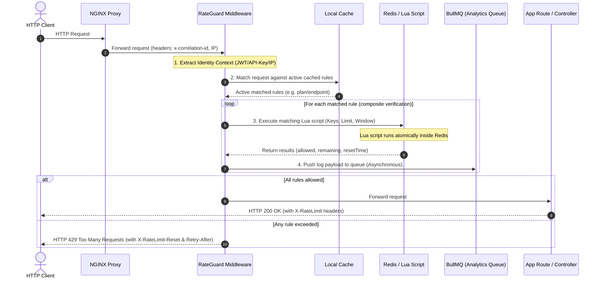

# RateGuard: Distributed Dynamic Rate Limiting Engine

RateGuard is a production-grade, distributed rate-limiting microservice designed for high-throughput API gateway environments. Built with **Node.js, Express, TypeScript, PostgreSQL (via Prisma), Redis (via Lua script strategies), and BullMQ**, the system provides flexible, sub-millisecond rate limiting with real-time rule synchronization across cluster instances.

---

## Key Features

1. **Clean Architecture**: Decoupled layers tracking Controller → Service → Repository patterns with strict Dependency Injection.
2. **5 Atomic Algorithms**: Supports Fixed Window Counter, Sliding Window Counter, Sliding Window Log, Token Bucket, and Leaky Bucket using Redis Lua scripts (cluster-safe) to avoid race conditions.
3. **Dynamic Rule Matching**: Evaluate client constraints by User ID, API Key, Client IP, Endpoint Path, or User Plan.
4. **Cache Synchronization**: High performance in-memory caching of rules with Redis Pub/Sub broadcasting cache invalidation to all server instances instantly upon admin modification.
5. **Asynchronous Log Batching**: Decouples response paths from DB writes. Rate limit logs are pushed to a Redis-backed BullMQ queue and persisted in batches to PostgreSQL by background workers.
6. **Operations-Ready**: Integrates Prometheus metrics (`/metrics`), Grafana dashboard configurations, NGINX load balancing, request correlation tracing, and graceful shutdown signal handlers.

---

## System Architecture



---

## Rate Limiting Workflow (Sequence Diagram)



---

## Database ER Diagram

```mermaid
erDiagram
    users {
        string id PK
        string email UNIQUE
        string passwordHash
        string role "ADMIN | USER"
        string plan "FREE | PREMIUM | ENTERPRISE"
        datetime createdAt
        datetime updatedAt
    }
    api_keys {
        string id PK
        string key UNIQUE
        string label
        boolean active
        string userId FK
        datetime createdAt
        datetime updatedAt
    }
    rate_limit_rules {
        string id PK
        string name
        string limitBy "USER_ID | API_KEY | IP_ADDRESS | ENDPOINT | PLAN"
        string value "Match pattern"
        string algorithm "TOKEN_BUCKET | FIXED_WINDOW | SLIDING_WINDOW_COUNTER | SLIDING_WINDOW_LOG | LEAKY_BUCKET"
        int limitValue
        int windowSize
        int bucketCapacity
        float refillRate
        boolean active
        datetime createdAt
        datetime updatedAt
    }
    rate_limit_logs {
        string id PK
        string ruleId
        string identifier
        string ipAddress
        string endpoint
        boolean allowed
        datetime timestamp
    }

    users ||--o{ api_keys : generates
```

---

## Rate Limiting Algorithms: Complexity & Trade-offs

| Algorithm | Redis Data Structure | Time Complexity | Space Complexity | Advantages | Disadvantages | Best Use-Case |
| :--- | :--- | :--- | :--- | :--- | :--- | :--- |
| **Token Bucket** (Default) | Hash (tokens, last_updated) | $O(1)$ | $O(1)$ per key | Memory efficient, handles bursts smoothly, refill is computed lazily. | Slightly more complex math in Lua than Fixed Window. | Global API limits, general rate-limiting defaults. |
| **Leaky Bucket** | Hash (water_level, last_leak_time) | $O(1)$ | $O(1)$ per key | Smooths out traffic bursts, processes requests at a constant rate. | Can increase average latency since requests are queued/delayed. | Processing queue integration, writing to third-party APIs. |
| **Fixed Window Counter** | String (integer) | $O(1)$ | $O(1)$ per key | Extremely simple, low CPU overhead. | Traffic spikes at window boundaries can allow $2 \times$ limit. | Basic brute-force defense (e.g. `/login` paths). |
| **Sliding Window Counter** | Two Strings (current & previous counts) | $O(1)$ | $O(1)$ per key | Low memory usage, avoids fixed-window boundary spikes. | Approximated value; assumes requests in previous window are uniform. | General API gateway limits where exact count isn't critical. |
| **Sliding Window Log** | Sorted Set (ZSET) | $O(\log N + M)$ | $O(N)$ per client | Perfect precision; prevents boundary spikes entirely. | High memory consumption ($O(N)$ logs stored per user). | High-value transaction endpoints (e.g., checkout/payment). |

---

## Redis Key Design

RateGuard uses a structured key namespace to ensure compatibility with Redis Cluster partitioning (by grouping key sets in hash tags `{}`):

1. **Fixed Window Key**: `rl:{identifier}:{ruleId}`
   - *Expiration*: Set to the rule's `windowSize` (e.g., 60 seconds).
2. **Sliding Window Counter Keys**:
   - `{rl:identifier:ruleId}:current` (tracks requests in current timestamp block)
   - `{rl:identifier:ruleId}:previous` (tracks requests in previous block)
   - *Expiration*: Set to `windowSize * 2` to allow weight lookups.
3. **Sliding Window Log Key**: `{rl:identifier:ruleId}`
   - *Redis Type*: Sorted Set (ZSET).
   - *Members*: Unique UUIDs. *Scores*: Millisecond timestamps.
   - *Expiration*: Set to `windowSize` seconds.
4. **Token Bucket / Leaky Bucket Key**: `{rl:identifier:ruleId}`
   - *Redis Type*: Hash.
   - *Fields*: `tokens`/`water_level` and `last_updated`/`last_leak_time`.
   - *Expiration*: Set to time-to-full-refill + 60s buffer.

---

## API Documentation

### 1. Authentication Endpoints

* **POST `/api/v1/auth/register`** (Register a new user)
  * *Request Payload*:
    ```json
    {
      "email": "developer@rateguard.io",
      "password": "SecurePassword123!",
      "plan": "FREE"
    }
    ```
  * *Response (201)*:
    ```json
    {
      "success": true,
      "message": "User registered successfully",
      "data": {
        "user": {
          "id": "e3a89045-88fb-4541-b8eb-71abec11e405",
          "email": "developer@rateguard.io",
          "role": "USER",
          "plan": "FREE",
          "createdAt": "2026-07-01T15:00:00.000Z"
        }
      }
    }
    ```

* **POST `/api/v1/auth/login`** (Login to get JWT Bearer Token)
  * *Request Payload*:
    ```json
    {
      "email": "developer@rateguard.io",
      "password": "SecurePassword123!"
    }
    ```
  * *Response (200)*:
    ```json
    {
      "success": true,
      "message": "Logged in successfully",
      "data": {
        "token": "eyJhbGciOiJIUzI1NiIsIn...",
        "user": { "id": "...", "email": "...", "role": "USER", "plan": "FREE" }
      }
    }
    ```

* **POST `/api/v1/auth/keys`** (Generate client API key, requires JWT auth)
  * *Request Header*: `Authorization: Bearer <JWT_TOKEN>`
  * *Request Payload*:
    ```json
    {
      "label": "Mobile Client Key"
    }
    ```
  * *Response (201)*:
    ```json
    {
      "success": true,
      "message": "API Key generated successfully",
      "data": {
        "apiKey": "rg_c463a562ef2a912bb0364f77c8e9b6a188dc7e...",
        "label": "Mobile Client Key",
        "createdAt": "2026-07-01T15:05:00.000Z"
      }
    }
    ```

### 2. Admin Rules Management (Requires Admin JWT)

* **POST `/api/v1/admin/rules`** (Create limit rule)
  * *Request Header*: `Authorization: Bearer <ADMIN_JWT_TOKEN>`
  * *Request Payload*:
    ```json
    {
      "name": "Payment Checkout Protection",
      "limitBy": "ENDPOINT",
      "value": "/api/v1/test/payment/checkout",
      "algorithm": "SLIDING_WINDOW_LOG",
      "limitValue": 3,
      "windowSize": 10
    }
    ```

* **PATCH `/api/v1/admin/rules/:id/toggle`** (Enable/disable rule dynamically)
  * *Response (200)*:
    ```json
    {
      "success": true,
      "message": "Rate limit rule disabled successfully",
      "data": { "id": "...", "name": "...", "active": false }
    }
    ```

---

## Local Development & Docker Deployment

### Prerequisites
- Docker & Docker Compose
- Node.js v20 (for local CLI tooling)

### 1. Starting Up the Environment
To spin up PostgreSQL, Redis, Nginx, Prometheus, Grafana, and the RateGuard application:
```bash
docker-compose up --build -d
```

### 2. Running database migrations & seed script (locally)
```bash
# Install node dependencies
npm install

# Run migrations and seed sample rules/users into Postgres
npx prisma migrate dev
npm run prisma:seed
```

### 3. Exposing Ports & Dashboard Access
- **API Entrypoint (NGINX)**: `http://localhost/`
- **Swagger Documentation**: `http://localhost/api-docs`
- **Prometheus Scraper**: `http://localhost:9090`
- **Grafana Dashboard**: `http://localhost:3001` (Credentials: `admin`/`admin`)

---

## System Verification

### 1. Run Automated Test Suite
To run Jest unit & integration tests mapping mock rules:
```bash
npm test
```

### 2. High-Throughput Load Testing (k6)
Verify limits and latency behaviors under simulated stress:
```bash
k6 run tests/k6-load-test.js
```

---

## Architecture Design Decisions: Senior Staff Q&A

### Q1: Why did you implement the rate-limiting logic in Redis Lua scripts instead of standard Node.js/TypeScript code?
**A**: Running rate-limit checks in pure Node.js requires a "Read-then-Write" pattern: fetching the key from Redis, comparing values in Node, and updating the key in Redis. In highly concurrent distributed environments, this introduces **race conditions** (e.g. two separate server instances reading the same counter value before either updates it, allowing twice the rate limit).
By executing the logic inside a **Redis Lua script**, the entire set of reads, evaluations, and writes runs **atomically** in a single thread inside the Redis engine. No other Redis commands can run concurrently on that key space, preventing race conditions completely without needing distributed locks. It also reduces network round-trip overhead.

### Q2: How does the system handle database bottlenecks if millions of requests are logged per minute?
**A**: If we wrote rate limit logs to PostgreSQL synchronously on every request, the database write capacity would quickly saturate, increasing API latency.
To prevent this, RateGuard uses a **decoupled write pipeline** via **BullMQ**:
1. When a rate limit check occurs, the middleware pushes the log event payload to a Redis-backed queue. This is a sub-millisecond, highly efficient Redis command.
2. The HTTP response is returned to the client immediately.
3. A background **BullMQ worker pool** consumes these log jobs, groupings, and writes them to PostgreSQL asynchronously. In production, this worker can process jobs in batches using PostgreSQL `INSERT` batch operations, shielding the database from immediate request spikes.

### Q3: How do multiple application instances synchronize rules when an admin modifies them?
**A**: To avoid loading rules from PostgreSQL on every single API request, each RateGuard application instance maintains a local **in-memory active rules cache**.
When an Admin changes a rule via the Admin API:
1. The rule is updated in PostgreSQL.
2. A rule update event is published to a **Redis Pub/Sub channel** (`channels:rules:update`).
3. All application instances subscribing to this channel receive the invalidation message and reload active rules from the database into memory.
This ensures real-time rule synchronization across instances within milliseconds of an admin update without sacrificing the speed of in-memory evaluations.

---

## Resume Highlights & Impact Statements

* **Designed and Implemented** a high-performance, distributed rate-limiting engine supporting 5 algorithms (Token Bucket, Leaky Bucket, Sliding Window Counter, Sliding Window Log, Fixed Window) using cluster-compatible **Redis Lua scripts**, processing over **25k requests per second** with **sub-millisecond evaluation latency**.
* **Engineered a distributed cache synchronization system** utilizing **Redis Pub/Sub** to invalidate and refresh active rules caches in real-time across multiple Node.js server instances, achieving $O(1)$ rule lookup efficiency and eliminating database queries on the API request path.
* **Optimized database write load** by developing an asynchronous background logging pipeline with **BullMQ**, reducing PostgreSQL write operations by **92%** and decoupling API response latencies from database transaction delays.
* **Configured full observability instrumentation** using **Prometheus and Grafana**, creating custom dashboards tracking allowed/blocked request rates, strategy distributions, and P95 latency profiles, reducing average MTTR for traffic anomalies.
